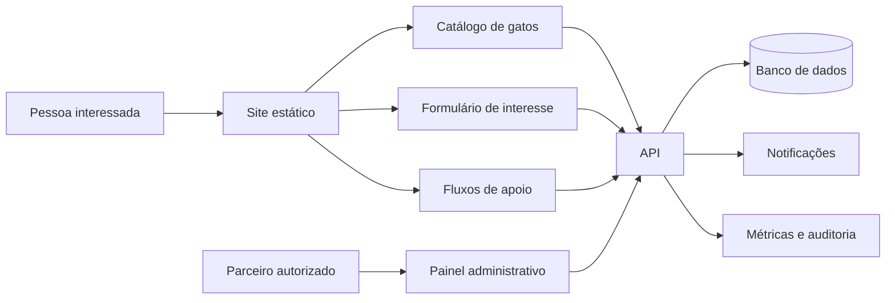

# Roadmap de evolução do Catlovers

> Diagnóstico iniciado em 16 de setembro de 2026. O retrato original foi atualizado após a execução das primeiras prioridades para distinguir problemas resolvidos de trabalho pendente.

## Andamento da execução — 24 de setembro de 2026

| Frente | Estado | Evidência |
| --- | --- | --- |
| Posicionamento | Concluído para o estágio atual | O site se identifica como demonstração em todos os idiomas; perfis, jornadas e formulários são fictícios, enquanto números de impacto, depoimentos, garantias e alegações de saúde sem fonte foram removidos. |
| Formulário | Concluído para demonstração | O fluxo valida e limpa os campos, informa que nenhum dado foi enviado e não simula contato futuro. |
| Vite | Concluído | A migração multipágina foi consolidada, resíduos do Parcel foram removidos e ambiente, documentação e Cypress usam a porta 1234. |
| PWA | Concluído para o contrato atual | Manifesto, ícones, screenshot, escopo, service worker e pré-cache de 76 recursos são validados na build; o Chromium confirma a navegação pelo app shell sem rede. |
| CI | Concluído | Instalação congelada, lint, i18n, catálogo, build e Cypress bloqueiam a publicação no GitHub Pages. |
| Internacionalização | Parcialmente concluído | O tradutor incompatível foi substituído; idades e metadados exibidos pela galeria possuem localização nos três catálogos, e o atributo `lang` usa valores BCP 47. A governança editorial e a cobertura de conteúdo por idioma ainda precisam evoluir. |
| Conteúdo editorial | Em andamento | O artigo de apresentação entre gatos identifica autoria, publicação e revisão editorial, resume um guia da FelineVMA e está disponível nos três idiomas. O inventário está em `EDITORIAL_INVENTORY.md`; as dicas de adaptação inicial, o checklist ambiental, os cenários fictícios e as perguntas do grupo clínico têm redação ajustada nos três idiomas, com fontes visíveis junto às orientações pertinentes. Para os grupos inventariados, autoria editorial e responsáveis pela revisão de PT-BR, EN e ES estão a definir; a revisão dos demais grupos continua pendente. |
| Tema | Concluído | A troca de tema permanece funcional quando o `localStorage` está indisponível ou o navegador não oferece `matchMedia`; a build preserva e valida a paleta escura, já publicada no GitHub Pages. |
| Testes | Em evolução | A suíte completa passou com 55 testes em dez especificações, além da navegação offline em Chromium; filtros, teclado, falha externa e fragmentos locais possuem cobertura. |
| Documentação | Concluído para a fundação atual | README, guia de contribuição e `humans.txt` descrevem Vite, pnpm, PWA, E2E e as limitações reais. |

### Próximas prioridades altas

1. Concluir autoria, revisão editorial e fontes para o conteúdo sobre cuidados e comportamento. O artigo de apresentação entre gatos já foi revisado; as dicas de adaptação inicial, o checklist ambiental e os cenários fictícios foram ajustados e referenciados. As perguntas do grupo clínico foram reformuladas; a WSAVA é citada apenas para vacinação. Para os grupos inventariados, autoria e responsáveis por PT-BR, EN e ES estão a definir; a revisão dos demais grupos continua pendente em `EDITORIAL_INVENTORY.md`.
2. Completar `canonical` e o conjunto de metadados sociais por página, com uma estratégia de indexação coerente para os três idiomas.
3. Fortalecer a demonstração com testes manuais e automatizados de acessibilidade, além de orçamentos de desempenho para os ativos publicados.
4. Definir a governança editorial de PT-BR, EN e ES e manter a paridade de conteúdo sem prometer uma operação de adoção.

## 1. Direção do produto

O Catlovers nasceu como um projeto educacional de HTML, CSS e JavaScript e já demonstra uma base front-end cuidadosa: treze páginas, três idiomas, tema claro e escuro, responsividade, recursos de acessibilidade, galeria, quiz, conteúdo educativo e suporte a instalação como PWA.

A decisão vigente é manter o Catlovers como portfólio educacional e demonstração de front-end. O projeto não representa animais reais, parceiros, atendimento, coleta ou persistência de manifestações de interesse, pagamentos nem promessa de resposta. Os perfis, histórias, números e fluxos publicados devem continuar claramente fictícios ou demonstrativos.

A comunicação atual já apresenta o Catlovers dessa forma: os perfis da galeria e os cenários de adaptação são identificados como fictícios; o formulário informa que não envia dados; e as páginas de adoção e apoio orientam o visitante a confirmar informações com uma organização real. O projeto não possui animais disponíveis, parceiros, atendimento ou fluxos operacionais.

Uma eventual plataforma de adoção permanece uma trilha futura e condicional, fora do escopo atual. Só deve ser retomada após nova decisão explícita, definição de responsável operacional, regiões atendidas, prazo de resposta (SLA), requisitos de privacidade e hospedagem adequada. Até que essas condições sejam decididas, os itens operacionais das fases posteriores servem apenas como histórico e cenário de planejamento; não são metas atuais nem promessas públicas.

### Proposta recomendada

O Catlovers deve oferecer uma demonstração educacional confiável de HTML, CSS e JavaScript, na qual visitantes compreendam o tema da adoção responsável e possam avaliar a qualidade de uma experiência acessível, multilíngue, responsiva, performática e testada. Conteúdo, i18n, SEO, PWA e testes devem receber prioridade enquanto nenhuma operação real estiver autorizada.

### Públicos prioritários

- Pessoas que querem aprender sobre adoção responsável por meio de conteúdo educativo, sem interpretar a demonstração como um serviço de adoção.
- Estudantes e desenvolvedores que usam o projeto para estudar HTML, CSS, JavaScript, acessibilidade, i18n, PWA, SEO e testes E2E.
- Visitantes que avaliam a clareza, a inclusão e a confiabilidade editorial de uma experiência web multilíngue.
- Colaboradores e revisores interessados em melhorar conteúdo, tradução e qualidade técnica.

### Resultado principal

O resultado principal é uma demonstração educacional coerente e verificável: as jornadas publicadas devem ser compreensíveis, acessíveis, responsivas, traduzidas e testadas, sem coletar dados pessoais nem sugerir que exista atendimento de adoção. Como não há operação nem telemetria de negócio no escopo atual, a evidência deve vir de conteúdo revisado, paridade de i18n, metadados SEO, orçamento de desempenho, testes E2E e auditorias manuais.

## 2. Retrato atual

### Tecnologias e arquitetura

| Área | Implementação atual | Avaliação |
| --- | --- | --- |
| Interface | HTML multipágina, CSS e JavaScript sem framework | Coerente com o objetivo educacional e suficiente para o próximo ciclo |
| Componentes HTML | Includes em `includes/`, processados por um plugin local do Vite | Reduz duplicação; os recursos resultantes são verificados na build |
| Build | Vite 8.3.0 com configuração multipágina em `vite.config.mjs` | Migração consolidada e resíduos do Parcel removidos |
| Dependências | pnpm e Fontsource; tradutor local sem dependência de runtime | Conjunto pequeno e compatível com o navegador |
| Estilos | BEM, propriedades customizadas, abordagem mobile-first e `prefers-reduced-motion` | Base consistente; `main.css` concentra mais de duas mil linhas |
| Dados | Seis gatos fictícios em `cats.json` | Suficientes para a demonstração; não constituem um inventário operacional |
| Estado no cliente | `localStorage` para idioma e tema; `sessionStorage` para curiosidades | Adequado para preferências, sem persistência de negócio; o tema continua funcional durante a sessão quando o armazenamento local está indisponível |
| Internacionalização | PT-BR, EN e ES, com paridade automática de chaves | Conteúdo dinâmico principal e metadados exibidos pela galeria são traduzidos; revisão editorial e cobertura de conteúdo ainda precisam evoluir |
| PWA | Manifesto, service worker, ícones, screenshot e pré-cache gerado | Estrutura validada na build; 76 recursos entram no pré-cache e a navegação offline foi verificada em Chromium |
| Qualidade | ESLint 10, Stylelint 17 e dez especificações Cypress | Lint, i18n, catálogo e build passam; 55 testes E2E passaram no Chromium |
| Entrega | GitHub Actions e GitHub Pages | A publicação depende de instalação congelada, lint, i18n, catálogo, build e E2E |
| Backend | Inexistente | Formulário, disponibilidade, parceiros e acompanhamento não são persistidos, conforme o escopo demonstrativo |
| Observabilidade | Erros apenas no console | Não há telemetria de uso ou de negócio; a próxima evolução deve priorizar evidências de qualidade sem introduzir coleta prematura |

### Funcionalidades existentes

- Página inicial com orientação, jornada ilustrativa, checklist, cenários fictícios e perguntas para uma adoção real.
- Guia demonstrativo de adoção e formulário com validação no navegador, sem envio de dados.
- Galeria de perfis fictícios com filtros por idade, sexo e temperamento.
- Simulação de compatibilidade com três perfis de resultado.
- Blog com três cards e um artigo implementado.
- Cenários educacionais de adaptação e orientações para verificar iniciativas externas de apoio.
- Tema claro e escuro, com preferência persistida quando o armazenamento está disponível; troca de idioma e navegação responsiva.
- Skip link, regiões `aria-live`, foco visível e tratamento de movimento reduzido.
- Imagens responsivas, fontes locais e cache para uso offline.

### Pontos fortes a preservar

- A restrição a tecnologias web fundamentais mantém o projeto compreensível e didático.
- A estrutura multipágina atende bem ao conteúdo editorial e favorece carregamento progressivo.
- Design, responsividade e acessibilidade já fazem parte da implementação, em vez de aparecerem como correção tardia.
- As traduções possuem validação automática de chaves.
- O projeto já tem testes de jornadas relevantes, convenções de contribuição e política de segurança.
- A separação entre dados dos gatos e renderização oferece um ponto natural para introduzir uma API no futuro.

## 3. Lacunas que determinam a prioridade

| Prioridade | Lacuna original | Situação atual | Consequência ou próximo passo |
| --- | --- | --- | --- |
| P0 | Migração de Parcel para Vite incompleta | Resolvida | Manter os contratos atuais protegidos pela CI. |
| P0 | Formulário simulava sucesso e descartava os dados | Resolvida para demonstração | O fluxo valida os campos, informa que nenhum dado foi enviado e não promete contato futuro. |
| P0 | Service worker e manifesto usavam caminhos incompatíveis com a saída do Vite | Resolvida | Preservar a validação da build e o teste offline no fluxo E2E. |
| P0 | Indicadores, depoimentos e garantias não apresentam fonte verificável | Resolvida para o estágio atual | Números de impacto, depoimentos, garantias, histórias apresentadas como reais e alegações de saúde sem fonte foram removidos ou substituídos por conteúdo demonstrativo verificável. |
| P0 | CI publicava sem executar lint, i18n ou E2E | Resolvida | Preservar os gates antes do deploy. |
| P1 | Gatos não têm perfil operacional, disponibilidade, localização ou responsável | Fora do escopo atual | Os seis perfis são fictícios e servem à demonstração; esses campos só serão necessários em uma futura operação autorizada. |
| P1 | O gato escolhido não acompanha o usuário até um formulário operacional | Fora do escopo atual | O formulário é demonstrativo e não coleta interesse; uma jornada persistida depende da decisão de reabrir a trilha operacional. |
| P1 | CTAs de apoio não executam ação | Resolvida para demonstração | Os controles sem destino foram removidos; a página orienta a procurar organizações reais. Fluxos operacionais continuam reservados à Fase 4. |
| P1 | Conteúdo dinâmico permanece parcialmente em português | Parcial | O tradutor e a cobertura dinâmica foram corrigidos; idades, cores, temperamentos, textos alternativos e estados vazios da galeria possuem localização, enquanto a governança editorial por idioma permanece pendente. |
| P1 | Testes verificavam sobretudo presença de elementos | Fortalecida | Filtros, responsividade, i18n, PWA, teclado, links e falha da API externa possuem cobertura; novas integrações exigirão seus próprios cenários. |
| P1 | Política de privacidade é genérica | Mitigada para demonstração | A página descreve os dados locais e os serviços externos atuais; qualquer coleta real ainda exigirá finalidade, retenção, direitos e contato definidos. |
| P2 | Blog e SEO têm estrutura incompleta | Parcial | `robots.txt`, `sitemap.xml` e `og:image` são publicados e validados; os cards repetem o mesmo artigo, e ainda faltam canonical e o conjunto social por página. |
| P2 | Build inclui 42 arquivos de fonte | Pendente | O custo de transferência ainda pode ser reduzido selecionando alfabetos, pesos e formatos realmente usados. |
| P2 | Imagens da galeria dependem do Unsplash | Pendente | A experiência offline fica incompleta e o produto depende de um terceiro. |
| P2 | Não há telemetria de produto ou erros | Fora do escopo atual | A demonstração deve usar testes e auditorias como evidência; qualquer telemetria futura exigirá decisão de privacidade e finalidade. |

## 4. Arquitetura de uma eventual operação

Esta é uma trilha futura e condicional, fora do escopo atual do portfólio educacional. Só deve ser retomada depois de nova decisão explícita, responsável operacional, regiões atendidas, SLA, requisitos de privacidade e hospedagem definidos. Até lá, o Catlovers permanece estático, sem backend e sem dados reais.

Em uma eventual retomada, a interface poderá continuar estática e sem framework enquanto essa opção mantiver o produto simples. O primeiro backend poderá ser uma API pequena ou um conjunto de funções serverless. A escolha do provedor deverá ocorrer depois de confirmar quem operará os contatos, onde o site será hospedado e quais dados precisarão ser retidos.

### Domínio mínimo

- **Gato:** identificador, nome, descrições por idioma, nascimento estimado, sexo, temperamento, necessidades especiais, saúde, castração, vacinação, compatibilidades, localização, imagens, parceiro, status e data de atualização.
- **Parceiro:** identificador, nome público, região atendida, contatos, responsáveis autorizados e estado de verificação.
- **Interesse de adoção:** gato, interessado, canal de contato, cidade, moradia, composição da casa, outros animais, consentimentos, origem, status e histórico.
- **Caso de adoção:** responsável, etapas, encontro, decisão, data da adoção, acompanhamentos e encerramento.
- **Apoio:** modalidade, pessoa, parceiro, disponibilidade, valor ou item quando aplicável e estado do contato.

### Princípios técnicos da trilha futura

- Manter HTML semântico, CSS e JavaScript modular como tecnologias de publicação.
- Introduzir backend somente nas fronteiras que exigem dados reais, segredos ou regras de negócio.
- Validar entradas no cliente para usabilidade e no servidor para integridade e segurança.
- Coletar apenas os dados necessários, definir prazo de retenção e registrar consentimentos.
- Tratar conteúdo, disponibilidade e tradução como dados versionados e validáveis.
- Projetar cada fluxo para teclado, leitor de tela, telas pequenas e conexão instável.
- Medir valor e confiabilidade sem registrar dados pessoais desnecessários.

## 5. Plano de execução

As durações abaixo expressam ordem e tamanho relativo. A Fase 1 e a Fase 3 orientam o trabalho atual da demonstração; as fases operacionais posteriores são uma trilha futura e condicional, sem datas vigentes.

### Fase 0 — Direção demonstrativa e integridade da proposta

**Horizonte sugerido:** uma semana

**Objetivo:** manter a comunicação fiel ao caráter educacional e demonstrativo do projeto.

- [x] Definir o estágio atual como portfólio educacional e identificar publicamente o caráter demonstrativo.
- [x] Registrar que não existem animais reais, parceiros, atendimento, coleta ou persistência de manifestações de interesse, pagamentos nem promessa de resposta.
- [x] Remover números de impacto, depoimentos, histórias, garantias e alegações de saúde sem origem verificável.
- [x] Identificar como demonstração qualquer informação que ainda não possa ser comprovada.
- [ ] Definir uma linha de base das jornadas demonstrativas: navegação, galeria, quiz, conteúdo educativo e formulário local sem envio.
- [ ] Registrar prioridades de acessibilidade, conteúdo, i18n, SEO, desempenho e testes em documentos curtos no repositório.

**Critérios de saída**

- Toda promessa pública corresponde a uma capacidade existente ou está marcada como demonstração.
- O projeto não sugere coleta, atendimento ou acompanhamento que não existam.
- A equipe escolheu critérios de qualidade verificáveis para a demonstração.

### Fase 1 — Fundação confiável

**Horizonte sugerido:** duas a três semanas

**Objetivo:** consolidar Vite, testes, PWA e documentação antes de adicionar produto.

#### Build e ambiente

- [x] Concluir a migração para Vite em um commit próprio e remover configurações restantes do Parcel.
- [x] Definir uma única porta de desenvolvimento e usá-la no Vite, Cypress, README e guia de contribuição.
- [x] Declarar `engines.node` e `packageManager`; alinhar a documentação ao Node aceito por Vite 8 e Cypress 16.
- [x] Remover o Modernizr sem uso e suas referências de publicação.
- [x] Substituir a biblioteca de tradução por um carregador pequeno e compatível com o navegador.
- [x] Atualizar comandos, estrutura de diretórios e solução de problemas da documentação.

#### PWA e publicação

- [x] Publicar o service worker na raiz, com escopo explícito e caminhos compatíveis com a base do GitHub Pages.
- [x] Manter manifesto, ícones, screenshots e atalhos em caminhos presentes na build final.
- [x] Testar em navegador o contrato offline documentado, com rede desativada sobre a build publicada.
- [x] Remover `.htaccess`, pois o destino atual é o GitHub Pages.
- [x] Criar uma verificação automática de links locais, recursos do manifesto e conteúdo do service worker na saída de produção.

#### CI e testes

- [x] Fazer a CI executar `pnpm install --frozen-lockfile`, lint, validação de i18n, testes do catálogo, build e Cypress headless antes da publicação.
- [x] Remover `allowCypressEnv`, opção retirada do Cypress 16, e escolher um navegador suportado para CI.
- [x] Separar `test:e2e:open` de `test:e2e:run`; fazer `pnpm test` executar sem interface gráfica.
- [x] Corrigir testes dependentes de animação ou visibilidade fora da viewport e substituir asserções permissivas por resultados esperados.
- [x] Cobrir links e fragmentos locais, falha da API externa, menu por teclado, conteúdo dinâmico, manifesto e modo offline. O formulário demonstrativo não realiza envio de rede.

**Critérios de saída**

- Uma instalação limpa reproduz lint, testes e build com comandos documentados.
- A CI impede publicação quando qualquer verificação obrigatória falha.
- PWA, ícones, atalhos e navegação offline passam em teste sobre a pasta publicada.
- README, `CONTRIBUTING.md`, configuração e workflow descrevem a mesma ferramenta e o mesmo ambiente.

### Fase 2 — MVP real de adoção (trilha futura e condicional)

**Horizonte sugerido:** quatro a seis semanas

**Status:** fora do escopo atual. Só iniciar após nova decisão explícita sobre a operação, responsável operacional, regiões atendidas, SLA, privacidade e hospedagem.

**Objetivo eventual:** transformar visita e escolha em um contato real, rastreável e seguro, caso a trilha operacional seja autorizada.

#### Catálogo

- [x] Definir um schema para os gatos e validar todos os registros no build. O JSON Schema cobre o formato demonstrativo atual; fixtures inválidos cobrem erros de schema e IDs duplicados, e `pnpm check` confirma a validação no build.
- [ ] Adicionar identificador estável, status, parceiro, localização, saúde, compatibilidades e data de atualização.
- [ ] Criar uma página individual com URL compartilhável para cada gato.
- [ ] Exibir claramente os estados `disponível`, `em processo`, `adotado` e `indisponível`.
- [ ] Incluir filtros por localização, convivência com crianças e animais, necessidades especiais e perfil de energia.
- [ ] Substituir hotlinks por imagens mantidas pelo projeto ou por um serviço com contrato e fallback definidos.

#### Manifestação de interesse

- [ ] Preservar o gato escolhido da galeria ou do quiz até o formulário.
- [ ] Coletar somente os dados que realmente influenciam a triagem.
- [ ] Implementar API, validação no servidor, proteção contra abuso e persistência.
- [ ] Obter consentimento específico e vincular a política de privacidade no ponto de coleta.
- [ ] Enviar confirmação ao interessado e notificação ao responsável pelo animal.
- [ ] Exibir estado de envio, falha recuperável e protocolo; nunca confirmar uma solicitação que não tenha sido persistida.
- [ ] Registrar mudanças de estado do contato com data e responsável.

#### Privacidade e segurança

- [ ] Definir finalidade, base aplicável, retenção, exclusão e canal para exercício de direitos antes da coleta.
- [ ] Restringir o acesso administrativo por papel e registrar operações relevantes.
- [ ] Guardar segredos fora do repositório e impedir dados pessoais em logs e analytics.
- [ ] Definir backup, restauração e resposta a incidentes proporcionais aos dados armazenados.
- [ ] Revisar dependências automaticamente e corrigir vulnerabilidades segundo severidade e exposição.

**Critérios de saída**

- Um usuário escolhe um gato, envia interesse, recebe confirmação e pode citar um protocolo.
- O parceiro recebe o caso, altera seu estado e atualiza a disponibilidade do animal.
- Falhas da API não produzem confirmação falsa nem perda silenciosa.
- Dados pessoais possuem finalidade, prazo de retenção, controle de acesso e caminho de exclusão definidos.

### Fase 3 — Confiança, inclusão e descoberta da demonstração

**Horizonte sugerido:** três a cinco semanas

**Objetivo:** tornar as jornadas demonstrativas completas, compreensíveis, inclusivas e encontráveis.

#### Experiência e acessibilidade

- [x] Fechar o menu móvel com `Escape`, atualizar seu rótulo nos três idiomas e controlar o foco ao abrir e fechar.
- [ ] Tornar o card de gato acionável por teclado com semântica de link, sem duplicar controles concorrentes.
- [ ] Permitir limpar os filtros, compartilhar um perfil e retornar à mesma posição da galeria.
- [ ] Evoluir o quiz com critérios do catálogo, mais de um resultado compatível, justificativa da recomendação e uma regra de desempate explícita.
- [ ] Anunciar envio, erros, filtros e resultado do quiz de forma adequada a tecnologias assistivas.
- [ ] Testar as jornadas principais apenas com teclado e com leitor de tela.
- [ ] Integrar uma auditoria automatizada de acessibilidade aos testes e revisar manualmente os pontos que a automação não cobre.

#### Internacionalização

- [x] Localizar, na camada de exibição, idades, cores, temperamentos, textos alternativos e estados vazios da galeria.
- [x] Usar valores BCP 47 no atributo `lang` (`pt-BR`, `en-US`, `es-ES`) em todas as atualizações; o mapeamento fica centralizado em `js/main.js` e possui cobertura no Cypress.
- [ ] Definir quem revisa cada idioma e qual é o processo para publicar conteúdo novo.
- [ ] Avaliar a necessidade editorial de EN e ES com revisão de conteúdo e evidências agregadas, sem introduzir telemetria pessoal como requisito.

#### Conteúdo e SEO

- [ ] Criar artigos distintos para os três cards atuais e impedir links editoriais duplicados por teste.
- [x] Informar autoria, data de publicação, data de revisão editorial, fonte e limite do conteúdo no artigo sobre apresentação entre gatos, em PT-BR, EN e ES.
- [x] Inventariar as demais orientações educativas sobre saúde e comportamento e registrar páginas, chaves, riscos editoriais e fontes candidatas em `EDITORIAL_INVENTORY.md`.
- [x] Ajustar as dicas de adaptação inicial em `adoption.html` nos três idiomas e incluir fontes institucionais junto às orientações correspondentes; a página identifica o conteúdo como orientação geral, sem atribuir revisão veterinária.
- [x] Ajustar o checklist ambiental em `index.html` e `adoption.html` nos três idiomas e incluir fontes conferidas junto às orientações; autoria, revisão por idioma e data de revisão editorial continuam pendentes.
- [x] Ajustar os cenários fictícios em `index.html` e `happy-endings.html` nos três idiomas, com fontes visíveis e escopo de orientação geral; autoria, responsáveis pela revisão de PT-BR, EN e ES e data editorial seguem a definir.
- [x] Reformular as perguntas do grupo clínico em `index.html`, `adoption.html` e `benefits.html` nos três idiomas; vincular a WSAVA somente às menções sobre vacinação e manter decisões sobre o animal com o veterinário. Autoria, revisão por idioma e data editorial seguem a definir.
- [ ] Revisar e corrigir os demais grupos inventariados; definir autoria editorial, revisão por idioma e datas de revisão, incluir fontes junto às alegações pertinentes e só então considerá-los revisados.
- [x] Publicar `robots.txt` e gerar `sitemap.xml` na saída final.
- [x] Publicar `og:image` estável para as páginas geradas.
- [ ] Adicionar canonical e completar `og:title`, `og:description` e `og:url` por página.
- [ ] Adicionar dados estruturados apenas para informações reais e mantidas.
- [ ] Definir uma estratégia de indexação para idiomas; tradução somente no cliente não cria páginas localizadas para busca.

#### Desempenho e resiliência

- [ ] Importar apenas alfabetos, pesos e formatos de fonte usados; a build atual gera 42 arquivos de fonte, cerca de 0,65 MiB.
- [ ] Definir dimensões ou proporção para todas as imagens e evitar mudanças de layout.
- [ ] Estabelecer orçamentos de CSS, JavaScript, fontes e imagens no CI.
- [x] Tratar a API de curiosidades como melhoria opcional: timeout, estado local na única língua em que o bloco aparece e nenhum erro ruidoso quando estiver indisponível.
- [ ] Medir LCP, INP, CLS e falhas de recursos nas páginas de maior tráfego.

**Critérios de saída**

- As jornadas demonstrativas de galeria, quiz, conteúdo e formulário informativo funcionam por teclado e nos três idiomas.
- Nenhum conteúdo de saúde ou impacto é publicado sem origem e data de revisão.
- Links, sitemap, canonical e metadados são validados na build.
- Os orçamentos de desempenho impedem crescimento acidental dos ativos.

### Fase 4 — Rede de apoio e acompanhamento (trilha futura e condicional)

**Horizonte sugerido:** seis a dez semanas, após validar o MVP futuro e obter nova autorização

**Status:** fora do escopo atual. Só iniciar depois das condições de retomada registradas na Fase 2 e de uma decisão específica sobre pagamentos, parceiros e acompanhamento.

**Objetivo eventual:** atender parceiros, outras formas de apoio e o período posterior à adoção.

- [ ] Criar fluxos funcionais e responsáveis para voluntariado, lar temporário, insumos e apadrinhamento.
- [ ] Se houver pagamento, usar um provedor especializado e registrar apenas identificadores e estados necessários.
- [ ] Permitir que parceiros autorizados cadastrem gatos, revisem interessados e atualizem disponibilidade.
- [ ] Implementar moderação, trilha de auditoria e processo de verificação de parceiros.
- [ ] Agendar lembretes e check-ins pós-adoção com consentimento e frequência definidos.
- [ ] Registrar devoluções, dificuldades de adaptação e encaminhamentos para melhorar o processo.
- [ ] Permitir relatos de finais felizes mediante autorização de publicação.

**Critérios de saída**

- Cada CTA de apoio termina em uma ação confirmada e atribuída a um responsável.
- Parceiros mantêm o catálogo sem acesso aos dados de outras organizações.
- A equipe mede tempo de resposta, conclusão de casos, devoluções e participação nos check-ins.

## 6. Próximo ciclo de qualidade da demonstração

| Frente | Entrega | Evidência esperada |
| --- | --- | --- |
| Conteúdo | Revisar e documentar fontes das orientações educativas; criar artigos distintos para os cards atuais | Autoria, datas e fontes visíveis no artigo revisado; demais alegações com origem verificável; links editoriais específicos |
| Acessibilidade | Testar teclado, leitor de tela, foco, estados dinâmicos e movimento reduzido | Cenários automatizados e checklist manual atualizado |
| i18n | Revisar PT-BR, EN e ES e manter paridade de conteúdo | Validação de chaves, revisão por idioma e atributo `lang` coerente |
| SEO | Completar `canonical`, metadados sociais e estratégia de indexação | Metadados e links validados na build |
| Desempenho e resiliência | Reduzir fontes, estabilizar imagens, definir orçamentos e medir Core Web Vitals | Limites de ativos no CI e evidências de LCP, INP e CLS quando a ferramenta estiver disponível |
| Testes e PWA | Preservar a suíte E2E, os gates da CI e o contrato offline | `pnpm check`, E2E e navegação offline aprovados sobre a build publicada |

## 7. Indicadores da demonstração

O escopo atual não inclui métricas de adoção, conversão, atendimento ou disponibilidade de animais. A qualidade deve ser acompanhada por evidências de build, testes, revisão editorial e auditorias manuais. Qualquer telemetria futura exigirá finalidade, minimização e uma decisão de privacidade antes de ser introduzida.

### Conteúdo e i18n

- Presença de aviso demonstrativo nas jornadas, perfis e formulários publicados.
- Artigos e orientações com autoria, data de revisão e fontes quando fizerem afirmações sobre saúde ou comportamento.
- Paridade de chaves e revisão de conteúdo em PT-BR, EN e ES.
- Estados vazios, textos alternativos e metadados dinâmicos localizados.

### Acessibilidade e jornadas

- Sucesso da CI, do lint, das validações de i18n e do catálogo, da build e dos testes E2E.
- Cobertura manual das jornadas por teclado, foco visível, leitor de tela e movimento reduzido.
- Funcionamento verificável de galeria, quiz, conteúdo educativo e formulário informativo sem envio de dados.
- Ausência de regressões em estados de carregamento, vazio, erro e nova tentativa quando aplicável.

### SEO, desempenho e resiliência

- Presença e consistência de `canonical`, metadados sociais, `robots.txt` e `sitemap.xml`.
- LCP, INP e CLS por página quando uma ferramenta disponível permitir a medição.
- Tamanho de CSS, JavaScript, fontes e imagens, protegido por orçamentos no CI.
- Navegação offline do app shell e fallback local quando integrações externas estiverem indisponíveis.

## 8. Hipóteses que precisam de validação

1. O aviso explícito de demonstração evita expectativas de atendimento sem prejudicar a compreensão do conteúdo educativo.
2. Conteúdo com autoria, data de revisão e fontes aumenta a confiança sem transformar a demonstração em aconselhamento profissional.
3. O quiz favorece a exploração educativa; seus resultados devem ser apresentados como simulação, nunca como recomendação sensível.
4. Navegação por teclado, foco visível e suporte a leitor de tela tornam as jornadas compreensíveis para mais visitantes.
5. Paridade editorial entre PT-BR, EN e ES justifica a presença dos três idiomas e reduz conteúdo incompleto ou contraditório.
6. Metadados completos e páginas tecnicamente estáveis melhoram a descoberta orgânica sem depender de conteúdo operacional.
7. A instalação e o uso offline resolvem uma necessidade relevante para o público; a PWA deve ser mantida enquanto houver evidência técnica ou educacional desse valor.
8. Imagens, fontes e integrações externas podem ser reduzidas ou substituídas sem perder o valor didático da demonstração.

Cada hipótese deve ter uma evidência testável, um período de revisão e uma decisão possível: manter, ajustar ou retirar. A validação deve evitar coleta de dados pessoais enquanto o projeto permanecer demonstrativo.

## 9. Riscos e respostas

| Risco | Resposta proposta |
| --- | --- |
| Visitante interpretar a demonstração como serviço real | Manter avisos claros, perfis fictícios, formulário sem envio e nenhuma promessa de resposta |
| Publicar conteúdo sem evidência | Criar governança editorial e publicar autoria, fonte e data de revisão |
| Regressão de acessibilidade | Cobrir teclado, leitor de tela, foco, contraste e movimento reduzido em testes e revisão manual |
| Traduções divergirem ou ficarem incompletas | Validar chaves, revisar cada idioma e tratar conteúdo novo como mudança editorial |
| SEO permanecer incompleto | Validar `canonical`, metadados sociais, `robots.txt`, `sitemap.xml` e indexação na build |
| Ativos crescerem sem controle | Definir orçamentos de CSS, JavaScript, fontes e imagens no CI |
| Acrescentar framework sem necessidade | Evoluir os módulos atuais e reconsiderar somente diante de complexidade comprovada |
| Dependência de APIs e imagens externas | Definir timeout, fallback, cache e responsabilidade por cada integração |
| Introduzir telemetria sem finalidade clara | Manter os testes como evidência atual e exigir decisão de privacidade antes de coletar eventos |
| Retomar a operação real sem preparo | Manter as fases operacionais pausadas até existir nova decisão, responsável, regiões, SLA, privacidade e hospedagem |
| PWA consumir manutenção sem valor demonstrável | Revisar a utilidade do app shell e do uso offline antes de ampliar o escopo |

## 10. Definição de pronto

Uma entrega está pronta quando:

- respeita o caráter educacional e demonstrativo, sem criar animais reais, parceiros, atendimento, coleta, persistência, pagamentos ou promessa de resposta;
- possui critérios de aceite ligados a uma jornada ou a um risco concreto;
- funciona em telas pequenas e grandes, por teclado e com movimento reduzido;
- cobre PT-BR e, quando fizer parte do escopo publicado, EN e ES;
- inclui estados de carregamento, vazio, sucesso, erro e nova tentativa quando aplicável;
- valida dados no limite adequado e não registra informações pessoais indevidas;
- acrescenta testes que protegem o comportamento relevante;
- passa por lint, validações de i18n e do catálogo, build e testes automatizados;
- atualiza documentação, política ou conteúdo relacionado;
- inclui uma evidência verificável para avaliar o resultado, sem exigir telemetria de negócio;
- pode ser publicada e revertida com procedimento conhecido.

## 11. Decisões pendentes

### Qualidade da demonstração

Estas decisões orientam o trabalho atual e não autorizam uma operação de adoção:

- Quem revisará cada idioma e qual será o processo para publicar conteúdo novo?
- Quais fontes, datas de revisão, autores e autorizações serão exigidos antes de publicar conteúdo sobre saúde, comportamento ou impacto?
- Qual estratégia de `canonical`, metadados sociais e indexação representará corretamente PT-BR, EN e ES?
- Quais jornadas terão cobertura manual de teclado, leitor de tela e movimento reduzido, além dos testes automatizados?
- Quais orçamentos de CSS, JavaScript, fontes e imagens serão adotados no CI?
- Quais imagens, fontes e integrações externas possuem licença, fallback e responsabilidade editorial claros?
- A manutenção da PWA e do app shell continuará justificável diante do valor técnico e educacional observado?

### Trilha operacional arquivada

A plataforma real permanece fora do escopo atual e não deve ser iniciada como consequência deste roadmap. Se uma nova decisão autorizar sua retomada, será necessário registrar antes dela:

- responsável operacional e organizações parceiras, com verificação dos dados;
- regiões atendidas e prazo de resposta (SLA) para cada contato;
- dados indispensáveis, finalidade, base aplicável, retenção, exclusão, consentimento e canal para exercício de direitos;
- hospedagem, API, controle de acesso, auditoria, backup e resposta a incidentes;
- regras para pagamentos, se essa modalidade vier a ser autorizada.

## 12. Verificações usadas neste diagnóstico

### Linha de base original

- `pnpm lint` e a validação de 336 chaves por idioma já passavam.
- A build passava, mas externalizava `fs` por causa do tradutor anterior.
- O Cypress no Electron falhava ao gerar artefatos neste ambiente e a suíte completa não terminava.
- A API de curiosidades falhava sem rede, confirmando a necessidade de fallback local.

### Estado após as primeiras prioridades

- `pnpm check`: aprovado com ESLint, Stylelint, i18n, testes do catálogo e build validada.
- `pnpm build`: aprovado sem o tradutor incompatível; 13 páginas, manifesto, recursos locais e pré-cache são verificados automaticamente.
- Cypress 16.1.0 no Chromium: 55 testes aprovados em dez especificações.
- Tema: o toggle continua funcional quando o `localStorage` lança `SecurityError` e quando `matchMedia` não existe; a build preserva a paleta escura publicada.
- Chrome DevTools Protocol: app shell carregado em um perfil isolado após desativar a rede do navegador.
- Validação da build: links para arquivos e fragmentos locais conferidos nas 13 páginas.
- Teste direcionado da galeria após fortalecer o filtro: cinco testes aprovados.
- Build local atual: 13 páginas, 22 entradas na raiz, 77 arquivos e aproximadamente 1,7 MB; 42 arquivos de fonte somam cerca de 0,65 MiB.
- O Lighthouse não foi executado porque a ferramenta não está disponível neste ambiente; a auditoria de desempenho permanece pendente, sem caracterizar falha da aplicação.

Esses resultados formam uma linha de base técnica, não uma certificação completa de acessibilidade, segurança, desempenho ou compatibilidade entre navegadores.
