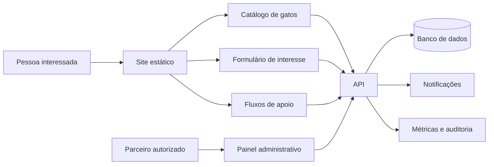

# Roadmap de evolução do Catlovers

> Diagnóstico iniciado em 16 de setembro de 2026. O retrato original foi atualizado após a execução das primeiras prioridades para distinguir problemas resolvidos de trabalho pendente.

## Andamento da execução — 21 de setembro de 2026

| Frente | Estado | Evidência |
| --- | --- | --- |
| Posicionamento | Concluído para o estágio atual | O site se identifica como demonstração em todos os idiomas; perfis, jornadas e formulários são fictícios, enquanto números de impacto, depoimentos, garantias e alegações de saúde sem fonte foram removidos. |
| Formulário | Concluído para demonstração | O fluxo valida e limpa os campos, informa que nenhum dado foi enviado e não simula contato futuro. |
| Vite | Concluído | A migração multipágina foi consolidada, resíduos do Parcel foram removidos e ambiente, documentação e Cypress usam a porta 1234. |
| PWA | Concluído para o contrato atual | Manifesto, ícones, screenshot, escopo, service worker e pré-cache de 76 recursos são validados na build; o Chromium confirma a navegação pelo app shell sem rede. |
| CI | Concluído | Instalação congelada, lint, i18n, build e Cypress bloqueiam a publicação no GitHub Pages. |
| Internacionalização | Parcialmente concluído | O tradutor incompatível foi substituído; idades e metadados exibidos pela galeria possuem localização nos três catálogos, mas a governança editorial e a cobertura de conteúdo por idioma ainda precisam evoluir. |
| Testes | Em evolução | A suíte completa passou com 53 testes em dez especificações, além da navegação offline em Chromium; filtros, teclado, falha externa e fragmentos locais possuem cobertura. |
| Documentação | Concluído para a fundação atual | README, guia de contribuição e `humans.txt` descrevem Vite, pnpm, PWA, E2E e as limitações reais. |

### Próximas prioridades altas

1. Registrar a decisão sobre uma eventual operação real, responsáveis, regiões e prazo de atendimento antes de habilitar qualquer coleta.
2. Definir o schema operacional dos gatos antes de criar perfis, disponibilidade e integração com parceiros.
3. Informar autoria, data de revisão e fontes no conteúdo editorial sobre cuidados e comportamento.
4. Completar canonical e o conjunto de metadados sociais por página antes de ampliar a descoberta orgânica.

## 1. Direção do produto

O Catlovers nasceu como um projeto educacional de HTML, CSS e JavaScript e já demonstra uma base front-end cuidadosa: treze páginas, três idiomas, tema claro e escuro, responsividade, recursos de acessibilidade, galeria, quiz, conteúdo educativo e suporte a instalação como PWA.

A comunicação atual apresenta o Catlovers como demonstração educacional. Os perfis da galeria e os cenários de adaptação são identificados como fictícios; o formulário informa que não envia dados; e as páginas de adoção e apoio orientam o visitante a confirmar informações com uma organização real. O projeto ainda não possui animais disponíveis, parceiros, atendimento ou fluxos operacionais.

Qualquer evolução para uma operação real deve preservar essa transparência e implementar as capacidades prometidas antes de ampliar o conjunto de funcionalidades. Existem duas direções válidas:

1. **Portfólio educacional:** manter o site como demonstração, identificar claramente dados e fluxos fictícios e concentrar o investimento em qualidade técnica.
2. **Plataforma de adoção:** integrar parceiros reais, receber manifestações de interesse, manter a disponibilidade dos animais e acompanhar cada caso.

Este roadmap recomenda a segunda direção, executada em etapas. Caso não exista equipe para responder aos contatos e atualizar os animais, a primeira etapa deve terminar com o reposicionamento transparente como demonstração.

### Proposta recomendada

O Catlovers deve ajudar uma pessoa a avaliar se pode adotar, encontrar animais compatíveis em parceiros confiáveis e enviar uma manifestação de interesse que receberá resposta dentro de um prazo conhecido. Conteúdo educativo e acompanhamento devem reduzir dúvidas antes e depois da adoção.

### Públicos prioritários

- Pessoas que consideram a primeira adoção e precisam entender custos, segurança e adaptação.
- Famílias que procuram um gato compatível com a moradia, a rotina, crianças e outros animais.
- Protetores e organizações que precisam divulgar animais e organizar interessados.
- Pessoas que podem contribuir com lar temporário, apadrinhamento, insumos, transporte ou trabalho voluntário.

### Resultado principal

A métrica central deve ser o número de **adoções responsáveis confirmadas por mês**. Enquanto o produto ainda não acompanhar adoções concluídas, deve usar como aproximação o número de **manifestações de interesse válidas, respondidas dentro do prazo**.

## 2. Retrato atual

### Tecnologias e arquitetura

| Área | Implementação atual | Avaliação |
| --- | --- | --- |
| Interface | HTML multipágina, CSS e JavaScript sem framework | Coerente com o objetivo educacional e suficiente para o próximo ciclo |
| Componentes HTML | Includes em `includes/`, processados por um plugin local do Vite | Reduz duplicação; os recursos resultantes são verificados na build |
| Build | Vite 8.3.0 com configuração multipágina em `vite.config.mjs` | Migração consolidada e resíduos do Parcel removidos |
| Dependências | pnpm e Fontsource; tradutor local sem dependência de runtime | Conjunto pequeno e compatível com o navegador |
| Estilos | BEM, propriedades customizadas, abordagem mobile-first e `prefers-reduced-motion` | Base consistente; `main.css` concentra mais de duas mil linhas |
| Dados | Seis gatos em `cats.json` | Bom protótipo, insuficiente como inventário operacional |
| Estado no cliente | `localStorage` para idioma e tema; `sessionStorage` para curiosidades | Adequado para preferências, sem persistência de negócio |
| Internacionalização | PT-BR, EN e ES, com paridade automática de chaves | Conteúdo dinâmico principal e metadados exibidos pela galeria são traduzidos; revisão editorial e cobertura de conteúdo ainda precisam evoluir |
| PWA | Manifesto, service worker, ícones, screenshot e pré-cache gerado | Estrutura validada na build; 76 recursos entram no pré-cache e a navegação offline foi verificada em Chromium |
| Qualidade | ESLint 10, Stylelint 17 e dez especificações Cypress | Lint, i18n e build passam; 53 testes E2E passaram no Chromium |
| Entrega | GitHub Actions e GitHub Pages | A publicação depende de instalação congelada, lint, i18n, build e E2E |
| Backend | Inexistente | Formulário, disponibilidade, parceiros e acompanhamento não são persistidos |
| Observabilidade | Erros apenas no console | Não há visibilidade de conversão, falhas ou disponibilidade |

### Funcionalidades existentes

- Página inicial com orientação, jornada ilustrativa, checklist, cenários fictícios e perguntas para uma adoção real.
- Guia demonstrativo de adoção e formulário com validação no navegador, sem envio de dados.
- Galeria de perfis fictícios com filtros por idade, sexo e temperamento.
- Simulação de compatibilidade com três perfis de resultado.
- Blog com três cards e um artigo implementado.
- Cenários educacionais de adaptação e orientações para verificar iniciativas externas de apoio.
- Tema claro e escuro, troca de idioma, navegação responsiva e preferências persistidas.
- Skip link, regiões `aria-live`, foco visível e tratamento de movimento reduzido.
- Imagens responsivas, fontes locais e cache para uso offline.

### Pontos fortes a preservar

- A restrição a tecnologias web fundamentais mantém o projeto compreensível e didático.
- A estrutura multipágina atende bem ao conteúdo editorial e favorece carregamento progressivo.
- Design, responsividade e acessibilidade já fazem parte da implementação, em vez de aparecerem como correção tardia.
- As traduções possuem validação automática de chaves.
- O projeto já tem testes de jornadas relevantes, convenções de contribuição e política de segurança.
- A separação entre dados dos gatos e renderização oferece um ponto natural para introduzir uma API no futuro.

## 3. Lacunas que determinam a prioridade

| Prioridade | Lacuna original | Situação atual | Consequência ou próximo passo |
| --- | --- | --- | --- |
| P0 | Migração de Parcel para Vite incompleta | Resolvida | Manter os contratos atuais protegidos pela CI. |
| P0 | Formulário simulava sucesso e descartava os dados | Resolvida para demonstração | O fluxo valida os campos, informa que nenhum dado foi enviado e não promete contato futuro. |
| P0 | Service worker e manifesto usavam caminhos incompatíveis com a saída do Vite | Resolvida | Preservar a validação da build e o teste offline no fluxo E2E. |
| P0 | Indicadores, depoimentos e garantias não apresentam fonte verificável | Resolvida para o estágio atual | Números de impacto, depoimentos, garantias, histórias apresentadas como reais e alegações de saúde sem fonte foram removidos ou substituídos por conteúdo demonstrativo verificável. |
| P0 | CI publicava sem executar lint, i18n ou E2E | Resolvida | Preservar os gates antes do deploy. |
| P1 | Gatos não têm perfil, disponibilidade, localização ou responsável | Pendente | O usuário não consegue tomar uma decisão informada. |
| P1 | O gato escolhido não acompanha o usuário até o formulário | Pendente | A jornada perde contexto no ponto de maior intenção. |
| P1 | CTAs de apoio não executam ação | Resolvida para demonstração | Os controles sem destino foram removidos; a página orienta a procurar organizações reais. Fluxos operacionais continuam reservados à Fase 4. |
| P1 | Conteúdo dinâmico permanece parcialmente em português | Parcial | O tradutor e a cobertura dinâmica foram corrigidos; idades, cores, temperamentos, textos alternativos e estados vazios da galeria possuem localização, enquanto a governança editorial por idioma permanece pendente. |
| P1 | Testes verificavam sobretudo presença de elementos | Fortalecida | Filtros, responsividade, i18n, PWA, teclado, links e falha da API externa possuem cobertura; novas integrações exigirão seus próprios cenários. |
| P1 | Política de privacidade é genérica | Mitigada para demonstração | A página descreve os dados locais e os serviços externos atuais; qualquer coleta real ainda exigirá finalidade, retenção, direitos e contato definidos. |
| P2 | Blog e SEO têm estrutura incompleta | Parcial | `robots.txt`, `sitemap.xml` e `og:image` são publicados e validados; os cards repetem o mesmo artigo, e ainda faltam canonical e o conjunto social por página. |
| P2 | Build inclui 42 arquivos de fonte | Pendente | O custo de transferência ainda pode ser reduzido selecionando alfabetos, pesos e formatos realmente usados. |
| P2 | Imagens da galeria dependem do Unsplash | Pendente | A experiência offline fica incompleta e o produto depende de um terceiro. |
| P2 | Não há telemetria de produto ou erros | Pendente | Decisões e incidentes dependem de impressões, sem uma linha de base. |

## 4. Arquitetura de destino

A interface deve continuar estática e sem framework enquanto essa opção mantiver o produto simples. O primeiro backend pode ser uma API pequena ou um conjunto de funções serverless. A escolha do provedor deve ocorrer apenas depois de confirmar quem operará os contatos, onde o site será hospedado e quais dados precisam ser retidos.

### Domínio mínimo

- **Gato:** identificador, nome, descrições por idioma, nascimento estimado, sexo, temperamento, necessidades especiais, saúde, castração, vacinação, compatibilidades, localização, imagens, parceiro, status e data de atualização.
- **Parceiro:** identificador, nome público, região atendida, contatos, responsáveis autorizados e estado de verificação.
- **Interesse de adoção:** gato, interessado, canal de contato, cidade, moradia, composição da casa, outros animais, consentimentos, origem, status e histórico.
- **Caso de adoção:** responsável, etapas, encontro, decisão, data da adoção, acompanhamentos e encerramento.
- **Apoio:** modalidade, pessoa, parceiro, disponibilidade, valor ou item quando aplicável e estado do contato.

### Princípios técnicos

- Manter HTML semântico, CSS e JavaScript modular como tecnologias de publicação.
- Introduzir backend somente nas fronteiras que exigem dados reais, segredos ou regras de negócio.
- Validar entradas no cliente para usabilidade e no servidor para integridade e segurança.
- Coletar apenas os dados necessários, definir prazo de retenção e registrar consentimentos.
- Tratar conteúdo, disponibilidade e tradução como dados versionados e validáveis.
- Projetar cada fluxo para teclado, leitor de tela, telas pequenas e conexão instável.
- Medir valor e confiabilidade sem registrar dados pessoais desnecessários.

## 5. Plano de execução

As durações abaixo expressam ordem e tamanho relativo. A capacidade da equipe e a disponibilidade de parceiros definirão as datas.

### Fase 0 — Decisão e integridade da proposta

**Horizonte sugerido:** uma semana

**Objetivo:** alinhar a comunicação com a capacidade operacional real.

- [x] Definir o estágio atual como portfólio educacional e identificar publicamente o caráter demonstrativo.
- [ ] Identificar quem receberá contatos, qual será o prazo de resposta e quais regiões serão atendidas.
- [x] Remover números de impacto, depoimentos, histórias, garantias e alegações de saúde sem origem verificável.
- [x] Identificar como demonstração qualquer informação que ainda não possa ser comprovada.
- [ ] Definir a linha de base das jornadas: visita, abertura da galeria, visualização de gato, início e conclusão de interesse.
- [ ] Registrar as decisões de arquitetura e operação em documentos curtos no repositório.

**Critérios de saída**

- Toda promessa pública corresponde a uma capacidade existente ou está marcada como demonstração.
- Existe um responsável e um prazo para responder a cada tipo de contato.
- A equipe escolheu o escopo do MVP e os indicadores que serão medidos.

### Fase 1 — Fundação confiável

**Horizonte sugerido:** duas a três semanas

**Objetivo:** consolidar Vite, testes, PWA e documentação antes de adicionar produto.

#### Build e ambiente

- [x] Concluir a migração para Vite em um commit próprio e remover configurações restantes do Parcel.
- [x] Definir uma única porta de desenvolvimento e usá-la no Vite, Cypress, README e guia de contribuição.
- [x] Declarar `engines.node` e `packageManager`; alinhar a documentação ao Node aceito por Vite 8 e Cypress 16.
- [x] Remover o Modernizr sem uso e suas referências de publicação.
- [x] Substituir a biblioteca de tradução por um carregador pequeno e compatível com o navegador.
- [x] Atualizar comandos, estrutura de diretórios e solução de problemas da documentação.

#### PWA e publicação

- [x] Publicar o service worker na raiz, com escopo explícito e caminhos compatíveis com a base do GitHub Pages.
- [x] Manter manifesto, ícones, screenshots e atalhos em caminhos presentes na build final.
- [x] Testar em navegador o contrato offline documentado, com rede desativada sobre a build publicada.
- [x] Remover `.htaccess`, pois o destino atual é o GitHub Pages.
- [x] Criar uma verificação automática de links locais, recursos do manifesto e conteúdo do service worker na saída de produção.

#### CI e testes

- [x] Fazer a CI executar `pnpm install --frozen-lockfile`, lint, validação de i18n, build e Cypress headless antes da publicação.
- [x] Remover `allowCypressEnv`, opção retirada do Cypress 16, e escolher um navegador suportado para CI.
- [x] Separar `test:e2e:open` de `test:e2e:run`; fazer `pnpm test` executar sem interface gráfica.
- [x] Corrigir testes dependentes de animação ou visibilidade fora da viewport e substituir asserções permissivas por resultados esperados.
- [x] Cobrir links e fragmentos locais, falha da API externa, menu por teclado, conteúdo dinâmico, manifesto e modo offline. O formulário demonstrativo não realiza envio de rede.

**Critérios de saída**

- Uma instalação limpa reproduz lint, testes e build com comandos documentados.
- A CI impede publicação quando qualquer verificação obrigatória falha.
- PWA, ícones, atalhos e navegação offline passam em teste sobre a pasta publicada.
- README, `CONTRIBUTING.md`, configuração e workflow descrevem a mesma ferramenta e o mesmo ambiente.

### Fase 2 — MVP real de adoção

**Horizonte sugerido:** quatro a seis semanas

**Objetivo:** transformar visita e escolha em um contato real, rastreável e seguro.

#### Catálogo

- [ ] Definir um schema para os gatos e validar todos os registros no build.
- [ ] Adicionar identificador estável, status, parceiro, localização, saúde, compatibilidades e data de atualização.
- [ ] Criar uma página individual com URL compartilhável para cada gato.
- [ ] Exibir claramente os estados `disponível`, `em processo`, `adotado` e `indisponível`.
- [ ] Incluir filtros por localização, convivência com crianças e animais, necessidades especiais e perfil de energia.
- [ ] Substituir hotlinks por imagens mantidas pelo projeto ou por um serviço com contrato e fallback definidos.

#### Manifestação de interesse

- [ ] Preservar o gato escolhido da galeria ou do quiz até o formulário.
- [ ] Coletar somente os dados que realmente influenciam a triagem.
- [ ] Implementar API, validação no servidor, proteção contra abuso e persistência.
- [ ] Obter consentimento específico e vincular a política de privacidade no ponto de coleta.
- [ ] Enviar confirmação ao interessado e notificação ao responsável pelo animal.
- [ ] Exibir estado de envio, falha recuperável e protocolo; nunca confirmar uma solicitação que não tenha sido persistida.
- [ ] Registrar mudanças de estado do contato com data e responsável.

#### Privacidade e segurança

- [ ] Definir finalidade, base aplicável, retenção, exclusão e canal para exercício de direitos antes da coleta.
- [ ] Restringir o acesso administrativo por papel e registrar operações relevantes.
- [ ] Guardar segredos fora do repositório e impedir dados pessoais em logs e analytics.
- [ ] Definir backup, restauração e resposta a incidentes proporcionais aos dados armazenados.
- [ ] Revisar dependências automaticamente e corrigir vulnerabilidades segundo severidade e exposição.

**Critérios de saída**

- Um usuário escolhe um gato, envia interesse, recebe confirmação e pode citar um protocolo.
- O parceiro recebe o caso, altera seu estado e atualiza a disponibilidade do animal.
- Falhas da API não produzem confirmação falsa nem perda silenciosa.
- Dados pessoais possuem finalidade, prazo de retenção, controle de acesso e caminho de exclusão definidos.

### Fase 3 — Confiança, inclusão e descoberta

**Horizonte sugerido:** três a cinco semanas

**Objetivo:** tornar as jornadas completas, compreensíveis e encontráveis.

#### Experiência e acessibilidade

- [x] Fechar o menu móvel com `Escape`, atualizar seu rótulo nos três idiomas e controlar o foco ao abrir e fechar.
- [ ] Tornar o card de gato acionável por teclado com semântica de link, sem duplicar controles concorrentes.
- [ ] Permitir limpar os filtros, compartilhar um perfil e retornar à mesma posição da galeria.
- [ ] Evoluir o quiz com critérios do catálogo, mais de um resultado compatível, justificativa da recomendação e uma regra de desempate explícita.
- [ ] Anunciar envio, erros, filtros e resultado do quiz de forma adequada a tecnologias assistivas.
- [ ] Testar as jornadas principais apenas com teclado e com leitor de tela.
- [ ] Integrar uma auditoria automatizada de acessibilidade aos testes e revisar manualmente os pontos que a automação não cobre.

#### Internacionalização

- [x] Localizar, na camada de exibição, idades, cores, temperamentos, textos alternativos e estados vazios da galeria.
- [ ] Usar valores BCP 47 no atributo `lang` (`pt-BR`, `en-US`, `es-ES`) em todas as atualizações.
- [ ] Definir quem revisa cada idioma e qual é o processo para publicar conteúdo novo.
- [ ] Medir o uso de EN e ES para justificar seu custo editorial.

#### Conteúdo e SEO

- [ ] Criar artigos distintos para os três cards atuais e impedir links editoriais duplicados por teste.
- [ ] Informar autor, data de publicação, data de revisão e fontes em conteúdo sobre saúde e comportamento.
- [x] Publicar `robots.txt` e gerar `sitemap.xml` na saída final.
- [x] Publicar `og:image` estável para as páginas geradas.
- [ ] Adicionar canonical e completar `og:title`, `og:description` e `og:url` por página.
- [ ] Adicionar dados estruturados apenas para informações reais e mantidas.
- [ ] Definir uma estratégia de indexação para idiomas; tradução somente no cliente não cria páginas localizadas para busca.

#### Desempenho e resiliência

- [ ] Importar apenas alfabetos, pesos e formatos de fonte usados; a build atual gera 42 arquivos de fonte, cerca de 0,65 MiB.
- [ ] Definir dimensões ou proporção para todas as imagens e evitar mudanças de layout.
- [ ] Estabelecer orçamentos de CSS, JavaScript, fontes e imagens no CI.
- [x] Tratar a API de curiosidades como melhoria opcional: timeout, estado local na única língua em que o bloco aparece e nenhum erro ruidoso quando estiver indisponível.
- [ ] Medir LCP, INP, CLS e falhas de recursos nas páginas de maior tráfego.

**Critérios de saída**

- As jornadas de galeria, detalhe e interesse funcionam por teclado e nos três idiomas.
- Nenhum conteúdo de saúde ou impacto é publicado sem origem e data de revisão.
- Links, sitemap, canonical e metadados são validados na build.
- Os orçamentos de desempenho impedem crescimento acidental dos ativos.

### Fase 4 — Rede de apoio e acompanhamento

**Horizonte sugerido:** seis a dez semanas, após validar o MVP

**Objetivo:** atender parceiros, outras formas de apoio e o período posterior à adoção.

- [ ] Criar fluxos funcionais e responsáveis para voluntariado, lar temporário, insumos e apadrinhamento.
- [ ] Se houver pagamento, usar um provedor especializado e registrar apenas identificadores e estados necessários.
- [ ] Permitir que parceiros autorizados cadastrem gatos, revisem interessados e atualizem disponibilidade.
- [ ] Implementar moderação, trilha de auditoria e processo de verificação de parceiros.
- [ ] Agendar lembretes e check-ins pós-adoção com consentimento e frequência definidos.
- [ ] Registrar devoluções, dificuldades de adaptação e encaminhamentos para melhorar o processo.
- [ ] Permitir relatos de finais felizes mediante autorização de publicação.

**Critérios de saída**

- Cada CTA de apoio termina em uma ação confirmada e atribuída a um responsável.
- Parceiros mantêm o catálogo sem acesso aos dados de outras organizações.
- A equipe mede tempo de resposta, conclusão de casos, devoluções e participação nos check-ins.

## 6. Primeiros 90 dias

| Período | Entrega | Evidência esperada |
| --- | --- | --- |
| Dias 1–15 | Decisões da Fase 0 e migração Vite consolidada | Proposta honesta, ambiente reproduzível e documentação alinhada |
| Dias 16–30 | CI completa, PWA reparada e E2E estável | Publicação bloqueada por qualidade e smoke test sobre `dist/` |
| Dias 31–45 | Schema de gatos e página de detalhe | Catálogo validado, status e URLs compartilháveis |
| Dias 46–75 | API de interesse e operação mínima | Envio persistido, confirmação, notificação e gestão de estado |
| Dias 76–90 | Piloto com poucos parceiros | Casos reais acompanhados, métricas básicas e decisão sobre a próxima fase |

## 7. Métricas

### Funil de adoção

- Visitas à galeria por origem e dispositivo.
- Abertura de perfil por visita à galeria.
- Início e conclusão do formulário por perfil.
- Solicitações entregues com sucesso e erros por etapa.
- Tempo até o primeiro contato humano.
- Conversão de interesse em encontro e de encontro em adoção.
- Motivos de encerramento e taxa de devolução.

### Saúde do catálogo

- Percentual de animais atualizados nos últimos sete dias.
- Tempo entre mudança real e atualização pública de status.
- Contatos recebidos sobre animais indisponíveis.
- Perfis sem dados essenciais ou sem imagem acessível.

### Qualidade técnica

- Taxa de sucesso da CI e frequência de regressões em produção.
- Disponibilidade do site e da API.
- Erros de JavaScript e de API por mil sessões.
- LCP, INP e CLS por página e dispositivo.
- Violações de acessibilidade e sucesso das jornadas por teclado.
- Tamanho de CSS, JavaScript, fontes e imagens na build.

### Apoio e conteúdo

- Contatos concluídos por modalidade de apoio.
- Leitura concluída e clique de artigo para perfil ou guia de adoção.
- Tráfego orgânico por tema.
- Uso e conversão por idioma.
- Avaliação de utilidade do quiz e da FAQ.

## 8. Hipóteses que precisam de validação

1. A escolha de um gato específico converte melhor do que um formulário genérico.
2. Localização, compatibilidade doméstica e disponibilidade pesam mais na escolha do que idade e sexo isolados.
3. O quiz melhora a descoberta e a qualidade do contato; caso sirva apenas como entretenimento, não deve orientar decisões sensíveis.
4. Pessoas aceitam um formulário curto quando o prazo e o responsável pelo retorno estão claros.
5. O acompanhamento pós-adoção reduz dificuldades de adaptação e devoluções.
6. Existe demanda operacional suficiente para manter fluxos separados de lar temporário, doação, apadrinhamento e voluntariado.
7. EN e ES recebem uso suficiente para justificar tradução e revisão contínuas.
8. Instalação e uso offline resolvem um problema relevante para o público; a PWA deve ser mantida somente se esse valor for observado.

Cada hipótese deve ter uma métrica, um período de observação e uma decisão possível: manter, ajustar ou retirar.

## 9. Riscos e respostas

| Risco | Resposta proposta |
| --- | --- |
| Lançar captação sem equipe de atendimento | Definir responsável e SLA antes de habilitar o envio |
| Catálogo desatualizado | Exigir data de revisão, alertar o parceiro e ocultar registros vencidos |
| Coletar dados pessoais em excesso | Usar minimização, retenção curta e revisão do formulário |
| Investir cedo em painel complexo | Começar com poucos parceiros e um fluxo administrativo simples |
| Manter promessas sem evidência | Criar governança editorial e publicar fonte e data |
| Acrescentar framework sem necessidade | Evoluir os módulos atuais e reconsiderar somente diante de complexidade comprovada |
| Dependência de APIs e imagens externas | Definir timeout, fallback, cache e responsabilidade por cada integração |
| Analytics ferir privacidade | Preferir eventos agregados, consentimento quando necessário e nenhuma PII |
| PWA consumir manutenção sem uso | Medir instalação e uso offline antes de ampliar o escopo |

## 10. Definição de pronto

Uma entrega está pronta quando:

- possui critérios de aceite ligados a uma jornada ou a um risco concreto;
- funciona em telas pequenas e grandes, por teclado e com movimento reduzido;
- cobre PT-BR e, quando fizer parte do escopo publicado, EN e ES;
- inclui estados de carregamento, vazio, sucesso, erro e nova tentativa quando aplicável;
- valida dados no limite adequado e não registra informações pessoais indevidas;
- acrescenta testes que protegem o comportamento relevante;
- passa por lint, validação de i18n, build e testes automatizados;
- atualiza documentação, política ou conteúdo relacionado;
- inclui a métrica necessária para verificar o resultado;
- pode ser publicada e revertida com procedimento conhecido.

## 11. Decisões pendentes

Estas respostas devem ser registradas antes da Fase 2, pois alteram arquitetura, custo e responsabilidade:

- O Catlovers continuará como demonstração ou terá uma futura etapa operacional? O estado publicado atual é demonstrativo.
- Quais organizações fornecerão os gatos e quem confirmará seus dados?
- Qual região geográfica será atendida no piloto?
- Quem receberá cada contato e em quanto tempo deverá responder?
- Quais dados são indispensáveis para triagem e por quanto tempo serão mantidos?
- O GitHub Pages continuará como hospedagem ou a API exigirá outro provedor?
- Quais idiomas possuem revisores e demanda real?
- Quais fontes, datas de revisão e autorizações serão exigidas antes de publicar futuros indicadores, depoimentos ou histórias?

## 12. Verificações usadas neste diagnóstico

### Linha de base original

- `pnpm lint` e a validação de 336 chaves por idioma já passavam.
- A build passava, mas externalizava `fs` por causa do tradutor anterior.
- O Cypress no Electron falhava ao gerar artefatos neste ambiente e a suíte completa não terminava.
- A API de curiosidades falhava sem rede, confirmando a necessidade de fallback local.

### Estado após as primeiras prioridades

- `pnpm check`: aprovado com ESLint, Stylelint, i18n e build validada.
- `pnpm build`: aprovado sem o tradutor incompatível; 13 páginas, manifesto, recursos locais e pré-cache são verificados automaticamente.
- Cypress 16.1.0 no Chromium: 53 testes aprovados em dez especificações.
- Chrome DevTools Protocol: app shell carregado em um perfil isolado após desativar a rede do navegador.
- Validação da build: links para arquivos e fragmentos locais conferidos nas 13 páginas.
- Teste direcionado da galeria após fortalecer o filtro: cinco testes aprovados.
- Build local atual: 13 páginas, 22 entradas na raiz, 77 arquivos e aproximadamente 1,7 MB; 42 arquivos de fonte somam cerca de 0,65 MiB.
- O Lighthouse não foi executado porque a ferramenta não está disponível neste ambiente; a auditoria de desempenho permanece pendente, sem caracterizar falha da aplicação.

Esses resultados formam uma linha de base técnica, não uma certificação completa de acessibilidade, segurança, desempenho ou compatibilidade entre navegadores.
