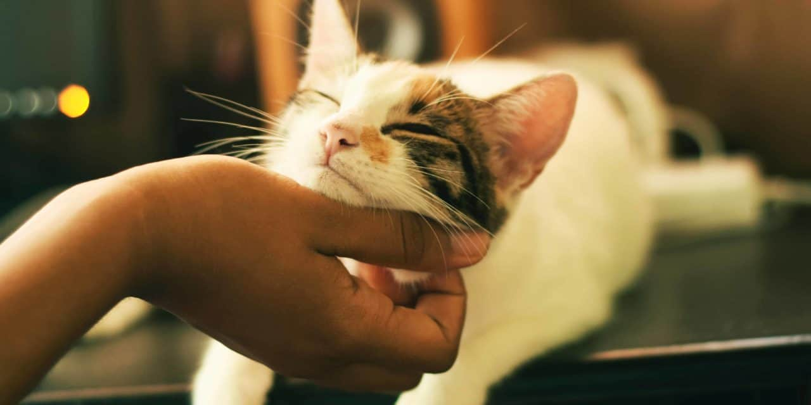

# Catlovers




> Este projeto tem como objetivo principal educacional, focado em tecnologias web fundamentais, e o incentivo à adoção
> responsável de gatinhos.

## 🌟 Diferenciais do Projeto

- **Tecnologias Fundamentais:** Desenvolvido puramente com HTML, CSS e JavaScript.
- **Internacionalização (i18n):** Suporte completo para Português, Inglês e Espanhol.
- **Acessibilidade (a11y):** Segue padrões WCAG, com alto contraste e suporte a leitores de tela.
- **Design Responsivo:** Adaptado para Mobile e Desktop (Mobile-First).
- **Estrutura Modular:** Uso de PostHTML para componentes reutilizáveis.

### Ajustes e melhorias

O projeto está em constante evolução. Confira o que já foi feito e o que está por vir:

- [x] Desenvolver a Landing Page
- [x] Implementar modo escuro/claro acessível
- [x] Adicionar suporte multi-idiomas
- [x] Modularizar o HTML com PostHTML
- [ ] Blog de notícias voltadas aos cuidados e adoção de gatos
- [ ] API de adoção (em estudo)

## 💻 Pré-requisitos

Antes de começar, verifique se você atendeu aos seguintes requisitos:

* Você instalou a versão mais recente do [Node.js](https://nodejs.org/)
* Você instalou o [pnpm](https://pnpm.io/)

## 🚀 Instalando Catlovers

Para instalar o Catlovers, siga estas etapas:

Linux, macOS e Windows:

```bash
pnpm install
```

## ☕ Usando Catlovers

Para rodar o projeto em ambiente de desenvolvimento:

```bash
pnpm run dev
```

Para gerar a build de produção:

```bash
pnpm run build
```

## 🤝 Colaboradores

Agradecemos às seguintes pessoas que contribuíram para este projeto:

<table>
  <tr>
    <td align="center">
      <a href="https://github.com/youhuul">
        <br>
        <sub>
          <b>Lucas Alves</b>
        </sub>
      </a>
    </td>
  </tr>
</table>

## 😄 Seja um dos contribuidores<br>

Quer fazer parte desse projeto? Clique [AQUI](CONTRIBUTING.md) e leia como contribuir.

Se tiver dúvidas, abra uma [Issue](https://github.com/youhuul/catlovers/issues).

## 📝 Licença

Esse projeto está sob licença. Veja o arquivo [LICENÇA](LICENSE.txt) para mais detalhes.

[⬆ Voltar ao topo](#catlovers)<br>
