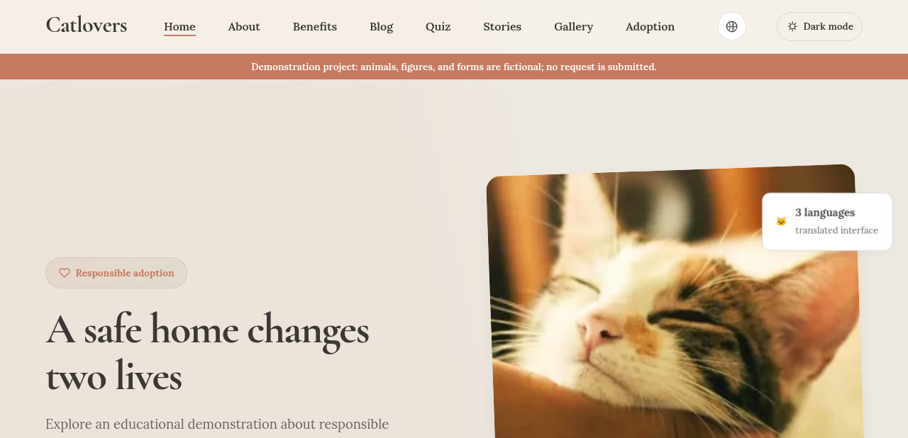

# Catlovers




Catlovers é um projeto educacional sobre adoção responsável de gatos, construído com HTML, CSS e JavaScript. A aplicação publicada funciona como demonstração: animais, histórias, números e formulários são fictícios, e nenhum pedido de adoção ou dado pessoal é enviado.

## Recursos

- Site multipágina responsivo, com tema claro e escuro.
- Interface em português, inglês e espanhol.
- Galeria com filtros, quiz de compatibilidade, blog demonstrativo e formulário local.
- Recursos de acessibilidade, como navegação por teclado, skip link, regiões `aria-live` e contraste de cores.
- PWA com manifesto, ícones e cache do app shell.
- Testes de ponta a ponta com Cypress e validações automatizadas de build e traduções.

## Tecnologias

- HTML5, CSS3 e JavaScript com módulos ES.
- Vite 8 para desenvolvimento e build multipágina.
- Plugin local do Vite para compor os fragmentos HTML de `includes/`.
- Fontsource com Lora e Cormorant Garamond.
- ESLint 10, Stylelint 17 e Cypress 16.
- GitHub Actions e GitHub Pages.

## Requisitos

- Node.js 24 recomendado. O projeto aceita `^22.13.0 || ^24.0.0 || >=26.0.0`.
- pnpm 11.
- Google Chrome para a execução E2E padrão.

A versão recomendada do Node também está em `.nvmrc`.

## Instalação

```bash
git clone https://github.com/c0destep/catlovers.git
cd catlovers
pnpm install --frozen-lockfile
```

## Desenvolvimento

```bash
pnpm dev
```

O Vite abre o site em `http://127.0.0.1:1234`. A porta é fixa para manter o ambiente local e o Cypress alinhados.

## Comandos

| Comando | Finalidade |
| --- | --- |
| `pnpm dev` | Inicia o servidor de desenvolvimento. |
| `pnpm build` | Gera `dist/`, prepara a PWA e valida páginas e recursos. |
| `pnpm preview` | Serve a build local na porta 1234. |
| `pnpm lint` | Executa ESLint e Stylelint. |
| `pnpm test:i18n` | Confere a consistência dos três catálogos de tradução. |
| `pnpm test:e2e:open` | Abre a interface do Cypress. |
| `pnpm test:e2e:run` | Inicia o preview, executa o Cypress e valida a navegação offline em um Chrome ou Chromium isolado. |
| `pnpm check` | Executa lint, validação de traduções e build. |
| `pnpm test` | Executa traduções, build e toda a suíte E2E. |

Para usar outro navegador instalado:

```bash
CYPRESS_BROWSER=chromium pnpm test:e2e:run
```

Argumentos adicionais são repassados ao Cypress. Por exemplo:

```bash
pnpm test:e2e:run -- --spec cypress/e2e/performance.cy.js
```

## Build e PWA

```bash
pnpm build
```

Além de compilar o site, esse comando:

1. publica o manifesto e os recursos estáveis da PWA;
2. gera a versão do cache e a lista de pré-cache a partir da build;
3. verifica as 13 páginas, os links para recursos locais, os ícones, a captura de tela e o service worker.

O funcionamento offline cobre o app shell gerado e é verificado em um navegador com a rede desativada. Conteúdo externo, como imagens do Unsplash e fatos carregados de uma API pública, continua dependendo de conexão.

## Estrutura

```text
catlovers/
├── css/                 # Estilos globais
├── cypress/e2e/         # Cenários de ponta a ponta
├── img/                 # Imagens processadas pelo Vite
├── includes/            # Fragmentos HTML compartilhados
├── js/                  # Comportamento, tradução e formulários
├── languages/           # Catálogos pt_BR, en_US e es_ES
├── public/              # Manifesto, service worker e recursos estáveis
├── scripts/             # Automação de build, i18n, imagens e E2E
├── *.html               # Páginas de entrada
└── vite.config.mjs      # Build multipágina e composição dos includes
```

## Limitações atuais

- Não existe backend nem integração com organizações de adoção.
- O formulário valida os campos apenas no navegador e não armazena dados.
- Alguns conteúdos e imagens externas não ficam disponíveis offline.
- As histórias e métricas apresentadas ainda precisam ser substituídas por conteúdo editorial verificável antes de qualquer uso operacional.

As próximas etapas, prioridades e critérios de conclusão estão no [ROADMAP.md](ROADMAP.md).

## Contribuição

Leia o [CONTRIBUTING.md](CONTRIBUTING.md) antes de enviar alterações. O projeto usa commits pequenos no padrão Conventional Commits e exige `pnpm check` antes da revisão.

## Licença

Distribuído sob a licença MIT. Consulte [LICENSE.txt](LICENSE.txt).

## Autor

**Lucas Alves** — [@c0destep](https://github.com/c0destep)
