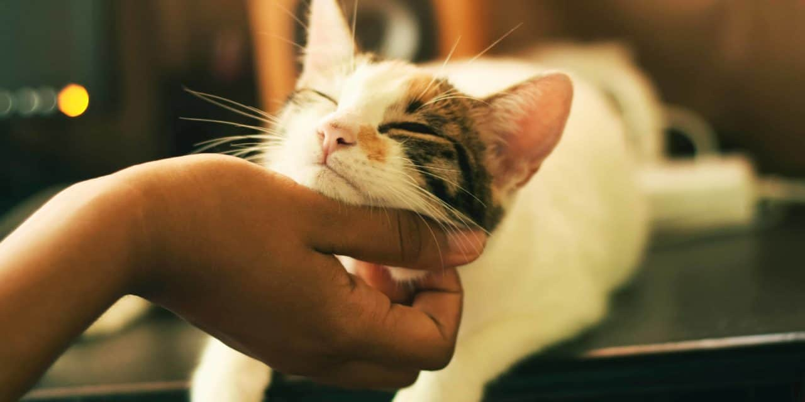

# Catlovers




> Este projeto tem como objetivo principal educacional, focado em tecnologias web fundamentais, e o incentivo à adoção responsável de gatinhos.

## 🌟 Diferenciais do Projeto

- **Tecnologias Fundamentais:** Desenvolvido puramente com HTML, CSS e JavaScript.
- **Internacionalização (i18n):** Suporte completo para Português, Inglês e Espanhol.
- **Acessibilidade (a11y):** Segue padrões WCAG, com alto contraste e suporte a leitores de tela.
- **Design Responsivo:** Adaptado para Mobile e Desktop (Mobile-First).
- **Estrutura Modular:** Uso de PostHTML para componentes reutilizáveis.
- **Performance:** Critical CSS, compressão gzip/Brotli, imagens responsivas e content-visibility.
- **Testes E2E:** Cypress para testes de aceitação.

### 📋 Checklist de Implementação

O projeto está em constante evolução. Confira o que já foi feito e o que está por vir:

- [x] Desenvolver a Landing Page
- [x] Implementar modo escuro/claro acessível
- [x] Adicionar suporte multi-idiomas
- [x] Modularizar o HTML com PostHTML
- [x] Galeria de gatos com filtros
- [x] Quiz de match com gatos
- [x] Critical CSS para performance
- [x] Compressão HTTP (gzip/Brotli)
- [x] ARIA live regions para acessibilidade
- [x] Imagens responsivas com srcset
- [x] Estados de loading na galeria
- [x] Content-visibility para renderização
- [ ] Blog de notícias voltadas aos cuidados e adoção de gatos
- [ ] API de adoção (em estudo)

## 💻 Pré-requisitos

Antes de começar, verifique se você atendeu aos seguintes requisitos:

* Você instalou a versão mais recente do [Node.js](https://nodejs.org/) (v18 ou superior)
* Você instalou o [pnpm](https://pnpm.io/) (gerenciador de pacotes)

```bash
# Verificar versões
node --version
pnpm --version
```

## 🚀 Instalando Catlovers

Para instalar o Catlovers, siga estas etapas:

Linux, macOS e Windows:

```bash
# Clone o repositório
git clone https://github.com/c0destep/catlovers.git
cd catlovers

# Instale as dependências
pnpm install
```

## ☕ Usando Catlovers

Para rodar o projeto em ambiente de desenvolvimento:

```bash
# Servidor de desenvolvimento com hot reload
pnpm run dev
```

O site estará disponível em `http://localhost:1234`

Para gerar a build de produção:

```bash
# Build otimizada para produção
pnpm run build

# Os arquivos serão gerados na pasta dist/
```

### 🧪 Executando Testes

```bash
# Testes E2E com Cypress
pnpm test:e2e

# Linting de código
pnpm lint
```

## 🔧 Troubleshooting

### Problemas comuns e soluções:

#### 1. Erro ao instalar dependências com pnpm

```bash
# Limpe o cache e tente novamente
pnpm store prune
rm -rf node_modules
pnpm install
```

#### 2. Porta 1234 já em uso

```bash
# O Parcel usa a porta 1234 por padrão. Mate o processo ou use outra porta:
pnpm run dev -- --port 3000
```

#### 3. Imagens não carregam no servidor de desenvolvimento

Verifique se o caminho das imagens está correto. O projeto usa processamento de imagens do Parcel com o parâmetro `?as=webp`.

#### 4. Traduções não funcionam

Verifique se os arquivos de idiomas em `languages/` estão presentes e se o `localStorage` não está bloqueado.

#### 5. Modo escuro não persiste

O tema é armazenado no `localStorage`. Limpe o armazenamento do navegador ou use o modo anônimo para testar.

#### 6. Build de produção falha

```bash
# Limpe a cache do Parcel
rm -rf .parcel-cache dist
pnpm run build
```

## 🏗️ Estrutura do Projeto

```
catlovers/
├── css/
│   ├── main.css          # Estilos principais
│   ├── normalize.css     # Normalização de estilos
│   └── preflight.css     # Preflight (do Parcel)
├── includes/             # Componentes HTML reutilizáveis
│   ├── header.html
│   ├── footer.html
│   ├── head-common.html
│   └── scripts.html
├── js/
│   ├── main.js           # Lógica principal (i18n, tema)
│   ├── cats.js           # Galeria e filtros de gatos
│   ├── quiz.js           # Quiz de match
│   └── helpers/          # Funções auxiliares
├── languages/            # Arquivos de tradução
│   ├── pt_BR.json
│   ├── en_US.json
│   └── es_ES.json
├── scripts/              # Scripts de automação (validate-i18n.js)
├── img/                  # Imagens e otimizações
├── cypress/              # Testes E2E
├── .github/              # Templates de issue e PR
├── index.html            # Página inicial
├── cats.html             # Galeria de gatos
├── quiz.html             # Quiz
├── adoption.html         # Página de adoção
├── .htaccess             # Configurações do servidor Apache
├── package.json          # Dependências e scripts
├── pnpm-lock.yaml        # Lock file
├── readme.md             # Este arquivo
```

## 🎨 Metodologia CSS

O projeto adota uma abordagem híbrida:
- **BEM (Block Element Modifier)** para classes de componentes
- **CSS Custom Properties** (variáveis) para tokens de design
- **Mobile-First** para responsividade

Exemplo:
```css
.card { /* block */ }
.card__title { /* element */ }
.card--highlight { /* modifier */ }
```

## 📱 Responsividade

O projeto segue breakpoints Mobile-First:

- **Mobile:** < 768px
- **Tablet:** 768px - 1024px
- **Desktop:** > 1024px

## ♿ Acessibilidade

- Navegação por teclado totalmente funcional
- ARIA labels e live regions para conteúdo dinâmico
- Skip link para pular conteúdo
- Contraste de cores WCAG AA
- Suporte a leitores de tela (NVDA, VoiceOver)

## 🤝 Como Contribuir

Contribuições são bem-vindas! Por favor, leia o [CONTRIBUTING.md](CONTRIBUTING.md) para detalhes sobre nosso código de conduta e o processo para enviar pull requests.

1. Faça um Fork do projeto
2. Crie uma branch para sua feature (`git checkout -b feature/AmazingFeature`)
3. Faça commit das mudanças (`git commit -m 'Add some AmazingFeature'`)
4. Faça push para a branch (`git push origin feature/AmazingFeature`)
5. Abra um Pull Request

## 📝 Licença

Este projeto está sob a licença MIT. Veja o arquivo [LICENSE.txt](LICENSE.txt) para mais detalhes.

## 🙋🏽 Autor

**Lucas Alves**
- GitHub: [@c0destep](https://github.com/c0destep)
- Email: lucas.alves.capristrano59@gmail.com

## 🎯 Roadmap Futuro

- [x] Blog com artigos sobre cuidados com gatos
- [x] PWA com funcionalidade offline completa (Service Worker + pre-cache)
- [ ] API de adoção integrada
- [ ] Sistema de cadastro de gatos
- [ ] Integração com redes sociais

## 📚 Recursos Úteis

- [Web Content Accessibility Guidelines (WCAG)](https://www.w3.org/WAI/standards-guidelines/wcag/)
- [MDN Web Docs](https://developer.mozilla.org/)
- [CSS Tricks](https://css-tricks.com/)
- [A11Y Project](https://www.a11yproject.com/)

---

⭐ **Deixe uma estrela se este projeto foi útil!**

[⬆ Voltar ao topo](#catlovers)
